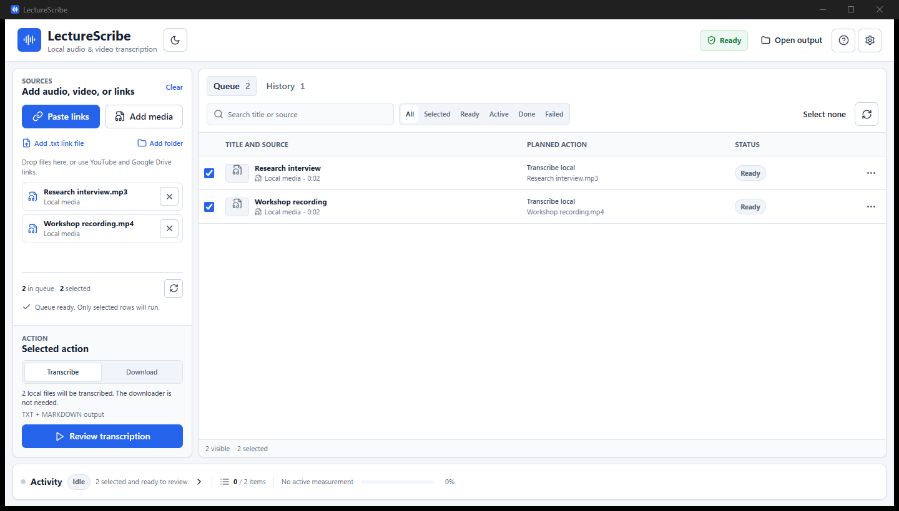

# LectureScribe

LectureScribe is a local-first Windows app for downloading media and turning audio or video into organized transcripts. It handles single files and large queues without a Python runtime or command-line setup.

[Download the latest release](https://github.com/Biexy/lecturescribe/releases/latest) | [Report a bug](https://github.com/Biexy/lecturescribe/issues/new/choose)



## What It Does

- Adds YouTube links, Google Drive file links, `.txt` link lists, folders, and local media.
- Previews and deduplicates the queue before a run.
- Transcribes only the rows you select.
- Downloads selected links without using Gemini.
- Reuses verified downloads, audio segments, and transcripts when a run is retried.
- Keeps run history and shows a completion summary with direct output actions.

LectureScribe has no account, subscription, telemetry, or cloud history. You bring your own Gemini API key.

## Install

### Installer

Download `LectureScribe_<version>_x64-setup.exe` from [Releases](https://github.com/Biexy/lecturescribe/releases). The installer includes the app and a pinned, checksum-verified `yt-dlp` downloader.

### Portable

Download `LectureScribe_0.2.0_x64-portable.zip` and its `.sha256` file from the v0.2.0 [GitHub Release](https://github.com/Biexy/lecturescribe/releases/tag/v0.2.0). Verify the SHA-256 checksum before extracting, extract the whole folder, and run `LectureScribe.exe`. Keep `LectureScribe.exe` and the `resources` folder together. ZIPs and checksums are release assets, not repository files.

FFmpeg is kept external to reduce package size. LectureScribe detects an existing FFmpeg and FFprobe installation or lets you choose the executables in Setup.

## First Run

1. Open **Setup** in the top-right header. The button remains labeled Setup and shows its current status beside the label.
2. Choose the workflow you want to prepare: download links, transcribe local media, or transcribe links.
3. For transcription, paste a Gemini API key into the **Gemini API key** card and select **Save key**.
4. LectureScribe validates the key and selected model. A saved but unverified key does not show as Ready.
5. Confirm FFmpeg, FFprobe, Downloader, and the output folder.
6. Run **Test transcription** for a one-request audio-pipeline check.

Download-only jobs do not need a Gemini key or FFmpeg.

## Get A Gemini API Key

Create a key in [Google AI Studio](https://aistudio.google.com/app/apikey), then paste it into **Setup > Gemini API key** inside LectureScribe. Google's [API key guide](https://ai.google.dev/gemini-api/docs/api-key) covers project and key management.

Enter the key only in **Setup > Gemini API key**. LectureScribe stores it in Windows Credential Manager. Do not put it in `.env`, command-line arguments, source files, settings JSON, logs, history, output files, or diagnostic exports.

The default model is `gemini-3.1-flash-lite`. The app also offers `gemini-3.5-flash` and an explicit custom-model check. LectureScribe never changes models automatically.

## Sources

Guaranteed providers:

- Local audio and video.
- YouTube video links.
- Google Drive file links.

Other URLs supported by `yt-dlp` are best effort. Playlist expansion asks for confirmation above 50 items and stops at 200. Version 0.2 rejects channels and live streams.

Supported local formats:

`mp3`, `m4a`, `wav`, `aac`, `flac`, `ogg`, `opus`, `mp4`, `mov`, `mkv`, and `webm`.

## Workflow

### Transcribe Selected

- Local media goes directly to verification and audio preparation.
- Link media downloads when no verified cached copy exists.
- FFmpeg normalizes audio to 16 kHz mono and creates silence-aware segments.
- Gemini transcribes each segment in the original spoken language and script.
- LectureScribe validates, merges, and writes the selected output package.

### Download Selected

- Selected links download to the batch `Media` folder.
- Local files are excluded because they are already on the computer.
- Gemini and FFmpeg are not required.

The preflight screen freezes the exact selected rows, batch folder, model, expected requests, reuse decisions, and blocked requirements before Start becomes available.

## Languages And Content Profiles

The default language setting detects speech and preserves it as spoken. Mixed-language audio remains mixed-language audio. LectureScribe does not translate or transliterate during transcription.

You can search a broad language list and add up to five recognition hints. Hints improve recognition but do not exclude unexpected languages. Content profiles cover general media, math and science, technical code, interviews, and multilingual recordings.

## Output

Each run receives a stable batch folder:

```text
Your output folder/
  Batch name/
    00 - Batch summary.html
    Transcripts/
      Recording title.txt
      Recording title.md
    Media/                         # only when requested
    Metadata/
      batch-manifest.json
```

Output packages:

- **Readable:** TXT and Markdown.
- **Subtitles:** SRT and VTT.
- **Complete:** TXT, Markdown, SRT, and VTT.
- **Custom:** any combination of those four formats.

User-facing transcripts, the HTML summary, and the manifest exclude source URLs, personal source paths, cookies, and model IDs. The local SQLite job ledger keeps the private data needed for retry and recovery.

## Privacy And Security

- Sources, downloads, cache, transcripts, settings, and job history stay on your computer.
- Prepared audio segments go to Gemini only during transcription.
- Download-only mode does not contact Gemini.
- Gemini Files API uploads are deleted after processing.
- Diagnostic exports remove keys, cookies, URLs, filenames, transcript content, and personal paths.
- No Python runtime, account, telemetry, subscription, or automatic model fallback is used.

## Build From Source

Requirements:

- Windows 10 or 11 on x64.
- Node.js and npm.
- Rust toolchain.
- WebView2 Runtime.
- FFmpeg and FFprobe for transcription and media tests.

```powershell
cd lecturescribe-tauri
npm install
npm run dev
```

Release checks:

```powershell
npm run test:frontend
npm run build:frontend
npm audit --audit-level=high
cargo fmt --all --manifest-path .\src-tauri\Cargo.toml -- --check
cargo check --workspace --manifest-path .\src-tauri\Cargo.toml
cargo test --workspace --manifest-path .\src-tauri\Cargo.toml
cargo clippy --workspace --all-targets --manifest-path .\src-tauri\Cargo.toml -- -D warnings
npm run build
npm run build:portable
```

`npm run build` downloads the pinned Windows `yt-dlp.exe`, verifies its SHA-256 checksum, and bundles it as a Tauri resource. `npm run build:portable` creates the ZIP, its `.sha256`, and `LectureScribe_0.2.0_SHA256SUMS.txt` for Installer, MSI, and Portable artifacts. Release artifacts are uploaded to the GitHub Release only; do not commit them. Complete [RELEASE_CHECKLIST.md](RELEASE_CHECKLIST.md) before upload.

## Troubleshooting

- **Key saved but transcription is blocked:** open Setup and run the key/model check. The error remains visible in Setup.
- **FFmpeg cannot prepare audio:** choose a matching FFmpeg and FFprobe pair in Setup, then retry. Verified media remains cached.
- **Private YouTube or Drive item fails:** configure browser cookies under Settings > Downloads only when you are authorized to access the source.
- **Downloader is missing:** open Setup and choose Install downloader. Release packages include the pinned binary.
- **Repeated text after retry:** keep Force retranscription off so verified segment results are reused.

Use **Setup > Export diagnostics** to create a sanitized report before filing an issue.

## Contributing

Read [RELEASE_CHECKLIST.md](RELEASE_CHECKLIST.md) before packaging. The old Python implementation remains under `archive/python-legacy` as reference and is not part of the app runtime or release.

LectureScribe is distributed under the [MIT License](LICENSE). Third-party notices are in [THIRD_PARTY_NOTICES.md](THIRD_PARTY_NOTICES.md).
